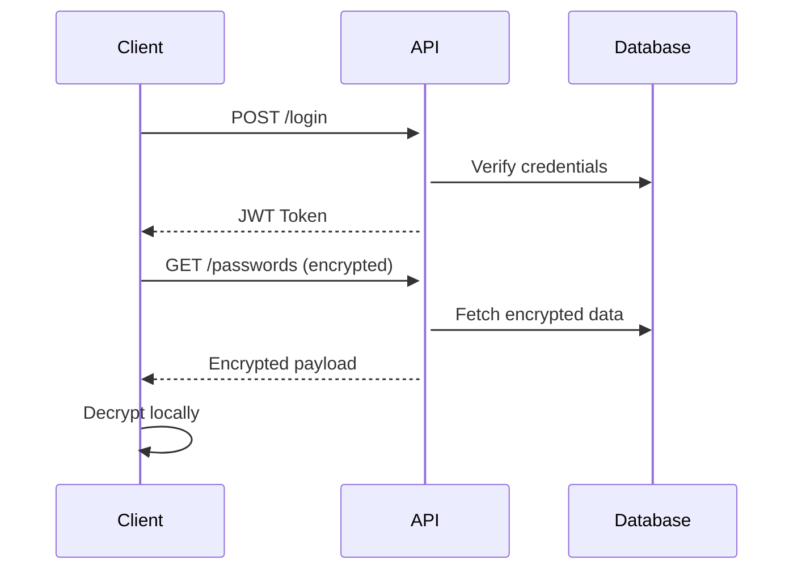

# Add-ReleaseNoteLineToREADME

> **Module:** GenXdev.Coding | **Type:** Function | **Aliases:** `releasenote

## Synopsis

> *(No synopsis provided)*

## Syntax

```powershell
Add-ReleaseNoteLineToREADME [[-Line] <String>] [-Code] [-Show] [-UseHomeREADME] [-UseOneDriveREADME] [<CommonParameters>]
```

## Parameters

| Name | Type | Required | Pipeline | Position | Default | Description |
|:---|:---|:---:|:---|:---:|:---|:---|
| `-Line` | String | — | — | 0 | `''` | The ReleaseNote description text to add |
| `-Code` | SwitchParameter | — | — | Named | — | Translate the following text into ru-RU. IMPORTANT TRANSLATION RULES:
1. Analyze the input format first - it could be code, markup, structured data, or plain text.
2. Preserve all syntax, structure, and technical elements like programming keywords, tags, or data format specific elements.
3. Only translate human-readable text portions like comments, string values, documentation, or natural language content.
4. Maintain exact formatting, indentation, and line breaks.
5. Never translate identifiers, function names, variables, or technical keywords.

You are a helpful assistant designed to output JSON.
## Response Format

Reply with JSON object ONLY. |
| `-Show` | SwitchParameter | — | — | Named | — | 
<!-- ====================================================================== -->
<!-- ====== CRITICAL JSON OUTPUT REQUIREMENT ===== -->
<!-- ====================================================================== -->

<div align="center">
  <h1>🔐 Password Manager API</h1>
  <p>A secure, self-hosted password management solution with end-to-end encryption</p>
  
  <!-- Badges -->
  
  
  
</div>

## 📋 Table of Contents
- [Features](#-features)
- [Architecture](#-architecture)
- [Getting Started](#-getting-started)
- [API Documentation](#-api-documentation)
- [Security](#-security)
- [Contributing](#-contributing)
- [License](#-license)

## ✨ Features

- **End-to-end encryption**: All passwords are encrypted client-side before transmission
- **Zero-knowledge architecture**: Server never has access to plaintext passwords
- **RESTful API**: Clean, documented API for easy integration
- **Multi-factor authentication**: Optional TOTP-based 2FA support
- **Password generator**: Built-in cryptographically secure password generator
- **Audit logging**: Track all access and modifications
- **Export/Import**: JSON-based data portability

## 🏗 Architecture



## 🚀 Getting Started

### Prerequisites
- Python 3.9+
- PostgreSQL or SQLite
- Docker (optional)

### Installation

```bash
# Clone repository
git clone https://github.com/yourusername/password-manager.git
cd password-manager

# Install dependencies
pip install -r requirements.txt

# Run migrations
alembic upgrade head

# Start server
uvicorn app.main:app --host 0.0.0.0 --port 8000
```

### Docker Deployment

```bash
docker-compose up -d
```

## 📚 API Documentation

### Authentication
| Method | Endpoint | Description |
|--------|----------|-------------|
| POST | `/api/v1/auth/register` | Register new user |
| POST | `/api/v1/auth/login` | User login |
| POST | `/api/v1/auth/refresh` | Refresh JWT token |

### Passwords
| Method | Endpoint | Description |
|--------|----------|-------------|
| GET | `/api/v1/passwords` | List all passwords |
| POST | `/api/v1/passwords` | Create new password entry |
| PUT | `/api/v1/passwords/{id}` | Update password |
| DELETE | `/api/v1/passwords/{id}` | Delete password |

> **Note**: All password data is encrypted/decrypted client-side. API receives only encrypted payloads.

## 🔒 Security

### Encryption Flow
1. Client generates AES-256-GCM key from master password using PBKDF2
2. Each password is encrypted with a unique IV
3. Encrypted data is stored server-side
4. Server never has access to plaintext or encryption keys

### Required Headers
```json
{
  "Authorization": "Bearer <jwt_token>",
  "X-Encryption-Key": "<base64_encrypted_key>"
}
```

## 🤝 Contributing

We welcome contributions! Please see our [Contributing Guidelines](CONTRIBUTING.md).

## 📄 License

This project is licensed under the MIT License - see the [LICENSE](LICENSE) file for details.

 |
| `-UseHomeREADME` | SwitchParameter | — | — | Named | — | Используйте README в домашнем каталоге |
| `-UseOneDriveREADME` | SwitchParameter | — | — | Named | — | Use README in OneDrive directory |

## Related Links

- [Add-ReleaseNoteLineToREADME on GitHub](https://github.com/genXdev/genXdev)
